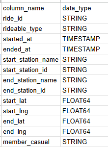
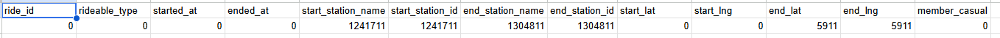
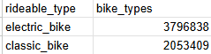
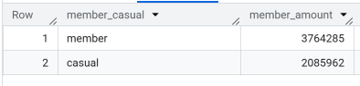

# Google Data Analytics Capstone: Cyclistic Case Study

Course: [Google Data Analytics Capstone: Complete a Case Study](https://www.coursera.org/learn/google-data-analytics-capstone)

## Introduction

In this case study, I will be assuming the role of a junior data analyst at Cyclistic, a bike sharing company.
In order to answer the key business questions, I will follow the steps of the data analysis process: [Ask], [Prepare], [Process], [Analyze], [Share], and [Act].

### Quick links:

Data Source: [divvy_tripdata](https://divvy-tripdata.s3.amazonaws.com/index.html) [accessed on 05/07/26]

SQL Queries:  
[01. Data Combining](https://github.com/randymramli/Cyclicist/blob/main/01.Data_Combining.sql)
[02. Data Exploration](https://github.com/randymramli/Cyclicist/blob/main/02.Data_Exploration.sql)
[03. Data Cleaning](https://github.com/randymramli/Cyclicist/blob/main/03.Data_Cleaning.sql)
[04. Data Analysis](https://github.com/randymramli/Cyclicist/blob/main/04.Data_Analysis.sql)

Data Visualizations: [Tableau]

## Background

### Cyclistic

Founded in Chicago, Cyclistic is a bike-share company that features more than 5,800 bysicles and 600 docking stations. The company sets itself apart by also offering reclining bikes, hand tricycles, and cargo bikes, making bike-share more inclusive to people with disabilities and riders who can’t use a standard two-wheeled bike. The majority of riders opt for traditional bikes; about 8% of riders use the assistive options. Cyclistic users are more likely to ride for leisure, but about 30% use the bikes to commute to work each day.

In 2016, Cyclistic launched a successful bike-share offering. Since then, the program has grown to a fleet of 5,824 bicycles that are geotracked and locked into a network of 692 stations across Chicago. The bikes can be unlocked from one station and returned to any other station in the
system anytime.

Until now, Cyclistic’s marketing strategy relied on building general awareness and appealing to broad consumer segments. One approach that helped make these things possible was the
flexibility of its pricing plans: single-ride passes, ull-day passes, and annual memberships. Customers who purchase single-ride or full-day passes are referred to as casual riders. Customers who purchase annual memberships are Cyclistic members.

Cyclistic’s finance analysts have concluded that annual members are much more profitable than casual riders. Although the pricing flexibility helps Cyclistic attract more customers, the marketing director, Lily Moreno, believes that maximizing the number of annual members will be key to future growth. Rather than creating a marketing campaign that targets all-new customers, Moreno believes there is a solid opportunity to convert casual riders into members. She notes that casual riders are already aware of the Cyclistic program and have chosen Cyclistic for their mobility needs.

### Scenario

I am assuming the role of a junior data analyst working in the marketing analyst team at Cyclistic. The director of marketing believes the company’s future success depends on maximizing the number of annual memberships. Therefore, my team wants to understand how casual riders and annual members use Cyclistic bikes differently. From these insights, my team will design a new marketing strategy to convert casual riders into annual members. But first, Cyclistic executives must approve our recommendations, so they must be backed up with compelling data insights and professional data visualizations.

## Ask

### Business Task

Devise marketing strategies to convert casual riders to members.

### Analysis Questions

Three questions will guide the future marketing program:

1. How do annual members and casual riders use Cyclistic bikes differently?
2. Why would casual riders buy Cyclistic annual memberships?
3. How can Cyclistic use digital media to influence casual riders to become members?

Moreno has assigned me the first question to answer: How do annual members and casual riders use Cyclistic bikes differently?

## Prepare

### Data Source

I will use Cyclistic’s historical trip data to analyze and identify trends from Jan 2025 to Dec 2025 which can be downloaded from [divvy_tripdata](https://divvy-tripdata.s3.amazonaws.com/index.html). The data has been made available by Motivate International Inc. under this [license](https://www.divvybikes.com/data-license-agreement).

This is public data that can be used to explore how different customer types are using Cyclistic bikes. But note that data-privacy issues prohibit from using riders’ personally identifiable information. This means that we won’t be able to connect pass purchases to credit card numbers to determine if casual riders live in the Cyclistic service area or if they have purchased multiple single passes.

### Data Organization

There are 12 files with naming convention of YYYYMM-divvy-tripdata and each file includes information for one month, such as the ride id, bike type, start time, end time, start station, end station, start location, end location, and whether the rider is a member or not. The corresponding column names are ride_id, rideable_type, started_at, ended_at, start_station_name, start_station_id, end_station_name, end_station_id, start_lat, start_lng, end_lat, end_lng and member_casual. There are 5850257 rows.

## Process

BigQuery is used to combine the various datasets into one dataset and clean it.  
Reason:  
A worksheet can only have 1,048,576 rows in Microsoft Excel because of its inability to manage large amounts of data. Because the Cyclistic dataset has more than 5.6 million rows, it is essential to use a platform like BigQuery that supports huge volumes of data.

### Combining the Data

SQL Query: [Data Combining](https://github.com/randymramli/Cyclicist/blob/main/01.Data_Combining.sql)
12 csv files are uploaded as tables in the dataset 'Merged_data'.

### Data Exploration

SQL Query: [Data Exploration](https://github.com/randymramli/Cyclicist/blob/main/02.Data_Exploration.sql)
Before cleaning the data, I am familiarizing myself with the data to understand it better.

1. The table below shows all the column names, with ride_id as the primary key
   

2. We then further check if there are any duplicates in the data, and we have found there are 298155 duplicate data. We then remove them.

3. Table below shows how many null values there are in each column
   

4. Based on the data, we know that there are 2 types of bikes: electric and classic. This table shows how many there are for each type.
   

5. This table below show the count for each user type available in the dataset
   
